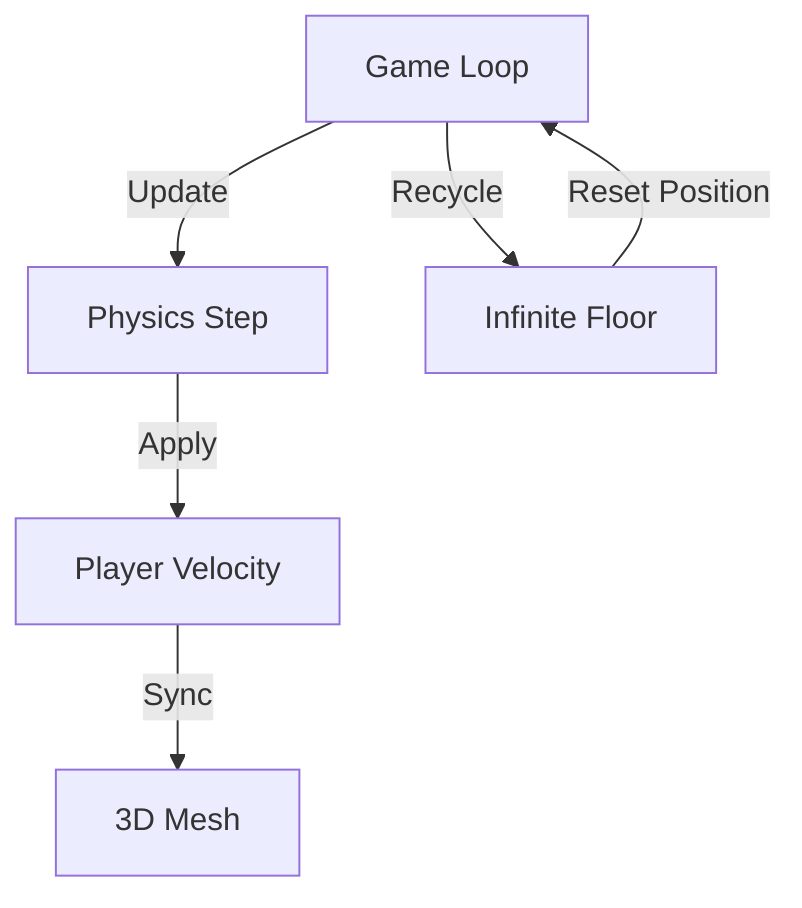

<div align="center">

# 🌌 Void-Runner
### High-Speed 3D Synthwave Experience
[](https://threejs.org/)
[](https://pmndrs.github.io/cannon-es/)
[](https://vitejs.dev/)
[]()

**Void-Runner** is a high-performance, 3D endless runner built for the modern browser. It features a procedurally generated neon universe, real-time physics, and a dynamic difficulty engine that scales with your skill.

[Play Now](https://void-runner-kamal.vercel.app) • [Game Mechanics](#-technical-specs) • [Controls](#-controls-guide)

</div>

---

## 🕹️ Controls Guide

| Action | Control | Result |
| :--- | :--- | :--- |
| **Move Left** | `ArrowLeft` / `A` | Physics-based lateral shift. |
| **Move Right** | `ArrowRight` / `D` | Physics-based lateral shift. |
| **Reset** | `R` | Reload the universe. |

---

## ⚙️ Technical Specs

| Engine | Implementation | Performance |
| :--- | :--- | :--- |
| **Rendering** | Three.js WebGL | 60 FPS Locked |
| **Physics** | Cannon-es | Real-time Collision |
| **Difficulty** | Linear Scaling Algorithm | Dynamic Speed |
| **Visuals** | FogExp2 & Emissive Lighting | Low-Latency Glow |
| **Memory** | Geometry Recycling | Infinite Runtime |

---

## 📐 Mechanics Deep-Dive

<details>
<summary><b>View Engine Architecture</b></summary>

Void-Runner uses a "Rolling Horizon" algorithm to recycle grid segments, ensuring that the game can run infinitely without increasing memory usage.


</details>

---

## 🏃 Getting Started

<details>
<summary><b>Quick Launch</b></summary>

1. **Clone**
   ```bash
   git clone https://github.com/kamalesh4044/void-runner.git && cd void-runner
   ```
2. **Launch**
   ```bash
   npm install && npm run dev
   ```
</details>

---

<div align="center">

### Engineered with 🖤 by [Kamal](https://github.com/kamalesh4044)
*Part of the Elite Engineering Series*

</div>
